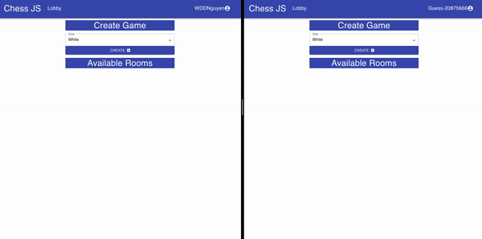
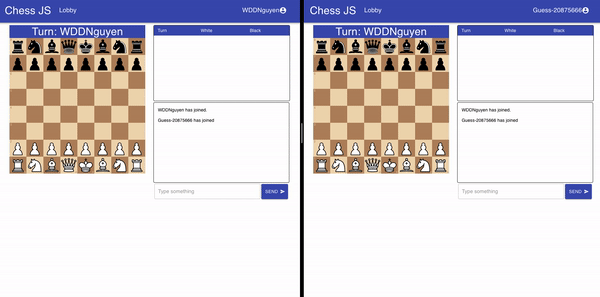

# Online Chess JS Client
Client for online chessJS over at https://github.com/WDDnguyen/chessjs_server.

This chess client provide users with a simple web application to play or watch chess matches by joining chess rooms through socket.io.

The client provide functionality to join in as a guest or sign up/sign in to user accounts.

When another player creates a room, all other users connected to the server will receive notification that the player has created a room.

First two players will be able to play the match while others that join the room can watch the games between the two players.

Each room contains a chessboard, move history and chat box which the two players can interact with. Chessboard is imported from Chessboardjsx.  Player can freely chat while playing and only the current player can move its piece when the game isn't over.

